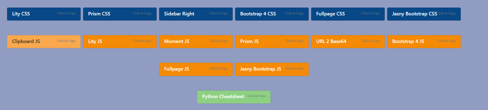

### FastCDN

This is a single page web-app to make importing CSS and JS files easier. Here's how - 

Say you constantly import the Bootstrap 4 CSS file. To do that you can go-to their website and copy it, you can copy it from a text file you've saved it in before, etc. Well all of those options are pretty tedious so I decided to create a personal "Content Delivery Network" using FastAPI, hence "FastCDN." Obviously you shouldn't use these imports in a production environment, but for home use or development it'll work perfect! 

### data.py

The data.py file contains a dictionary with various categories as the keys. In my case I've used "Javascript, CSS, and Cheatsheets." Their values are then lists of dictionaries that contain the keys "name" and "url." 

Example:

```py
all_data = {
    "javascript": [
        {
            "name": "Clipboard JS",
            "url": "https://cdn.jsdelivr.net/npm/clipboard@2.0.6/dist/clipboard.min.js"
        }
    ]
}
```

### Application

When the app runs it'll serve a single page at "/" that creates buttons for each of the items in the data file; organized by category and color coded for easy use. Just click them and the URL for the file will will be copied to the clipboard. You know hwo to do the rest!

Here's an example of my setup:




### Run the App

You can run locally `pip install -r requirements.txt` and then `uvicorn main:app --port 9001` and browse to http://localhost:9001. Note that the --port option is only required if the default uvicorn default 8000 is unavailable or distasteful to you. 

The other option is simply build a Docker Container using the provided file. 

```shell
docker build -t fastcdn .

docker run -d --name=fastcdn -p 9001:9001 -v /some/dir:/app/data fastcdn
```

OR 

Pull the image from Dockerhub `docker pull brettdocker/fastcdn` and run `docker run -d --name=fastcdn -p 9001:9001 -v /some/dir:/app/data brettdocker/fastcdn`


You will have to make sure the data.py file is available to the app at "/app/data/data.py" 